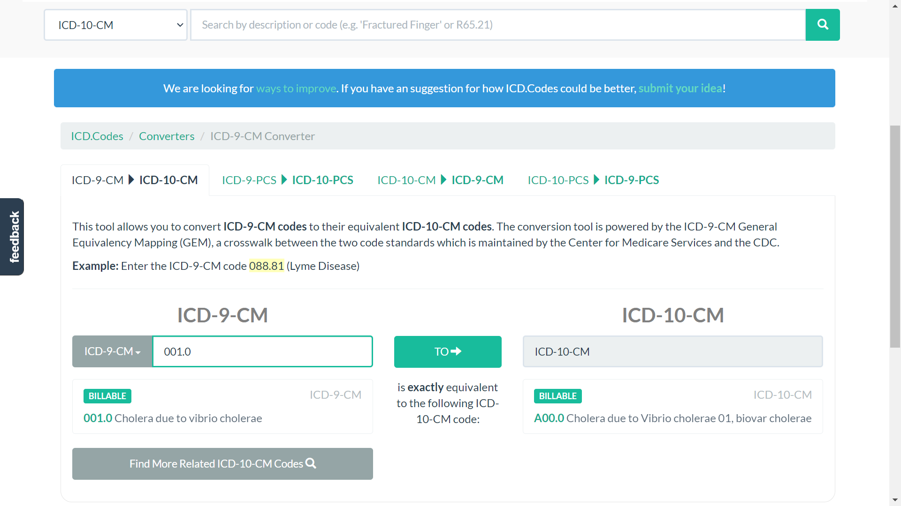
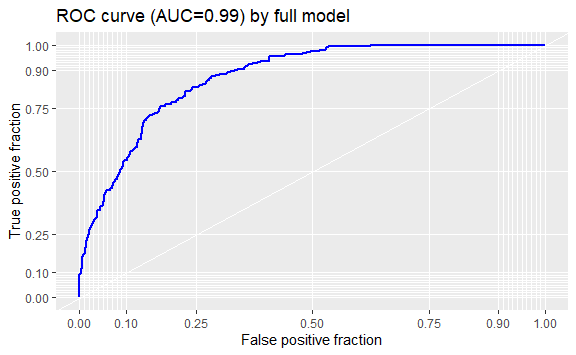
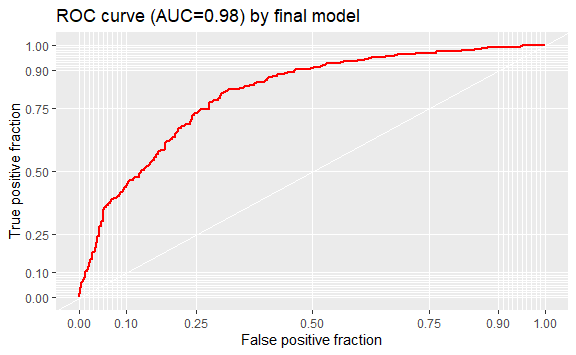

Final Project
================
Annie Lin
2022-12-16

## Project Proposal

There are many websites that can convert convert ICD-9 code into ICD-10
code (and vice versa), but they can only convert one code at a time,
which consumed me a lot of time when I did my BST210 regression project.
Thus, I want to use R to convert a set of ICD codes (as many as you
want) all at once.

For the 2nd part of this project, I will use data from Kaggle to build a
regression model to predict opioids overdose. Because back in Taiwan, I
was an anesthesiologist. In our daily practice, to treat patients’ pain,
opioids (such as morphine) are often used. However, opioids are very
easily to be addictive to. Once these drugs are used overdose (very
likely for those drug abusers), they would not only put people into
sleep but suppress their breath, heart rate, and blood pressure – but
people cannot react because they are deeply sedated! In the end, they
are usually found dead. To prevent these tragedies, if we can predict
people potentially with higher possibility of opioids overdose, we may
avoid using (or use less) these highly addictive drugs on them and adopt
other alternative treatment or medications.

## Part 1. Data Wrangling

## Introduction

My ICD codes files are from:
<https://www.nber.org/research/data/icd-9-cm-and-icd-10-cm-and-icd-10-pcs-crosswalk-or-general-equivalence-mappings>.

    #> [1] 23912

``` r
head(icd_cm)
#>   icd9cm icd10cm flags approximate no_map combination scenario choice_list
#> 1     10    A000     0           0      0           0        0           0
#> 2     11    A001     0           0      0           0        0           0
#> 3     19    A009     0           0      0           0        0           0
#> 4     20   A0100 10000           1      0           0        0           0
#> 5     21    A011     0           0      0           0        0           0
#> 6     22    A012     0           0      0           0        0           0
```

There are 23912 codes in this file, whereas the ICD-9 and ICD-10 codes
are not in the correct form. Take the first row for example, there is no
ICD-9 code = 10, instead, it should be 001.0, while the corresponding
ICD-10 code = A00.0, rather than A000.



Because of this error, there are identical ICD-9 codes in the file that
actually should be different and correspond to different ICD-10 codes.
Take ICD-9 = 320 in this file for example:

At the 12nd row, the ICD-9 = 320, and the ICD-10 = A0220.


However, there’s another ICD-9 = 320 at row 629, but this time ICD-10 =
A360.


These 320s should be 003.20 and 032.0, while the corresponding ICD-10
codes are A02.20 (not A0220) and A36.0 (not A360):


Now you may find out that (1) in the correct ICD-codes, there should be
3 numbers or 1 alphabet with 2 numbers before the decimal; (2) for ICD-9
codes, we may need to add 1 zero or 2 zeros to some of the original
codes in our file.

Thus, after checking with the correct codes, I found out that in our
file: (1) for the first 1-81 ICD-9 codes, we need to add “00” before the
original number, and then add “.” after the 3rd number; (2) for the
first 82-1211 ICD-9 codes, we need to add “0” before the original
number, and then add “.” after the 3rd number; (3) for the rest
1212-23912 ICD-9 codes, we need to add “.” after the 3rd number; (4) for
all the ICD-10 codes, we just need to add “.” after the 3rd number.

And never forget those not-matching ones. We know that either in ICD-9
or ICD-10, there should be digits. If it’s no digits, it might be “NA”
or “No data” or something similar.

After using string pattern to identify, there is no NA in our corrected
ICD-9 codes (GOOD!), but there are 425 “NoD.x” in the corrected ICD-10
codes, which needed to be replaced with NA.

Furthermore, the disease description into our wrangled dataset. The
datasets containing disease descriptions are also from:
<https://www.nber.org/research/data/icd-9-cm-and-icd-10-cm-and-icd-10-pcs-crosswalk-or-general-equivalence-mappings>.

There are two disease descriptions in the icd_cm_10d file, I will use
the more detailed one (the long description). And in these two files,
the codes also should be corrected just like above (add “0” or “00” to
ICD-9, and add “.” after the 3rd number in both the ICD-9 and ICD-10
codes).

After correction, we can join the tables.

Lastly, we need to add some warning signs because sometimes ICD-9 codes
cannot exactly match with the ICD-10 codes. Notice those flags? When the
flag = 0, it means we can find the exact ICD-10 codes; when the flag =
10000, it means we can only find the most similar meaning ICD-10 codes;
when the flag = 11000, sadly there’s no such ICD-10 codes. This is our
last step of data wrangling!

## Results

After data wrangling such as strings processing and tables joining, we
get our dreamy dataset (icd_cm_n)!

Let’s compare the difference. This is the original dataset (BEFORE):

``` r
head(icd_cm[1:8],3)
#>   icd9cm icd10cm flags approximate no_map combination scenario choice_list
#> 1     10    A000     0           0      0           0        0           0
#> 2     11    A001     0           0      0           0        0           0
#> 3     19    A009     0           0      0           0        0           0
```

And this is our corrected dataset (AFTER):

``` r
head(icd_cm_final,3)
#>   icd9cm_n icd10cm_n                      ICD9 Description
#> 1    001.0     A00.0        Cholera due to vibrio cholerae
#> 2    001.1     A00.1 Cholera due to vibrio cholerae el tor
#> 3    001.9     A00.9                  Cholera, unspecified
#>                                    ICD10 Description         matching
#> 1 Cholera due to Vibrio cholerae 01, biovar cholerae Exactly matching
#> 2    Cholera due to Vibrio cholerae 01, biovar eltor Exactly matching
#> 3                               Cholera, unspecified Exactly matching
```

Finally, we can start to search the corresponding ICD-10 codes! For
example, if I want to convert ICD-9 = “E93.00”,“003.1”,“032.0”, I can
use the codes below to find the corresponding ICD-10 codes along with
their matching extent in the summarize (footnote).

``` r
icd_cm_final |>
  filter(icd9cm_n %in% c("E93.00","003.1","032.0")) |> 
  summarise(icd9 = icd9cm_n, icd10 = icd10cm_n, footnote = matching)
#>     icd9 icd10              footnote
#> 1  003.1 A02.1 Approxiately matching
#> 2  032.0 A36.0      Exactly matching
#> 3 E93.00  <NA>           No matching
```

And we can directly copy the corresponding ICD-10 codes into our word
files or slides by using codes below:

``` r
exp1 = icd_cm_final |>
  filter(icd9cm_n %in% c("E93.00","003.1","032.0")) |> 
  summarise(icd9 = icd9cm_n, icd10 = icd10cm_n, footnote = matching) |>
  pull(icd10)

exp1 |> 
  paste(collapse = " ") |>
  str_replace_all(" ", ", ")    
#> [1] "A02.1, A36.0, NA"
```

Moreover, by using the codes below, we can directly copy a number of ICD
codes from word files and paste them into ” ” and search!! No need to
spend time to further separate them with ” “!

``` r
exp2 = c("E93.00, 003.1, 032.0")  
e2 = unlist(str_split(exp2, ", "))

icd_cm_final |>
  filter(icd9cm_n %in% c(e2[1:length(e2)])) |> 
  summarise(icd9 = icd9cm_n, icd10 = icd10cm_n, footnote = matching) |>
  pull(icd10)     
#> [1] "A02.1" "A36.0" NA
```

This is what I want!!

## Part 2. Regression Model

## Introduction

As mentioned above, I want to build a regression model to predict the
possibility of opioids overdose.

The dataset is from Kaggle, illustrating the opioids overdose rates in
different states in the U.S. There are many variables, such as health
spend (mcare_millions, medicaid_spend_actual, medicaidspending,
thealthspend, totalrealhcspend), job (unemployment_pct,
labor_participation_pct, is_manufacturing_state), finance (stategdpml,
realstategdp, insured_pct, post_recession, cpi), and education
(grad_hs_pct).

``` r
head(read.csv("D:\\Final project\\Opioid.csv"))
#>     state stateid year t mcare_millions medicaid_spend_actual medicaidspending
#> 1 Alabama       1 2000 0           3690                  2719          2.7e+09
#> 2 Alabama       1 2001 1           4065                  2902          2.9e+09
#> 3 Alabama       1 2002 2           4394                  3116          3.1e+09
#> 4 Alabama       1 2003 3           4756                  3506          3.5e+09
#> 5 Alabama       1 2004 4           5274                  3664          3.7e+09
#> 6 Alabama       1 2005 5           5698                  3864          3.9e+09
#>   thealthspend totalrealhcspend overdoses population overdose_rate
#> 1         6410             9410        43    4500000         0.956
#> 2         6970             9860        57    4500000         1.270
#> 3         7510            10500        71    4500000         1.580
#> 4         8260            11300        49    4500000         1.090
#> 5         8940            12000        83    4500000         1.840
#> 6         9560            12400        80    4600000         1.740
#>   mdhhincomereal stategdpml realstategdp unemployment_pct
#> 1          35424     119242       175098              4.6
#> 2          35160     122449       173338              5.1
#> 3          37603     127792       178858              5.9
#> 4          37255     133739       182443              6.0
#> 5          36629     146525       196108              5.7
#> 6          37150     155970       202728              4.5
#>   labor_participation_pct insured_pct grad_hs_pct is_manufacturing_state
#> 1                    60.3        87.5        77.5                      1
#> 2                    59.2        87.6        80.2                      1
#> 3                    58.2        87.8        78.9                      1
#> 4                    58.2        87.5        79.9                      1
#> 5                    58.5        88.0        82.4                      1
#> 6                    58.9        86.0        80.9                      1
#>   post_recession cpi
#> 1              0 169
#> 2              0 175
#> 3              0 177
#> 4              0 182
#> 5              0 185
#> 6              0 191
```

Firstly, the mean of opioids overdose rate is 8. I defined opioids
overdose rate \>8 as more likely to have opioids overdose, and \<=8 as
less likely, which becomes overdose_p in the data.

Secondly, Using overdose_p as outcome, putting all the possible
covariates into the model as our full model (logistic regression).

## Results

Though the performance of the full model is good (AIC= 417.32, AUC =
0.99), because there are many covariates related to finance, such as
thealthspend (total health spend) and totalrealhcspend (total real
hospital and clinics spend), considering collinearity and
simplicity/parsimony, stateid (state), totalrealhcspend (total health
spend), labor_participation_pct (labor or not), grad_hs_pct (education),
and cpi (consumer price index) are kept in my final model (s_model).

The performance of this final model is nice, with AIC: 551.68 and AUC =
0.9755.

``` r
data.frame(AIC_full = full_model$aic, AIC_select = s_model$aic)
#>   AIC_full AIC_select
#> 1      867       1066
```



## Conclusion

In part 1, I did data wrangling to convert ICD-9 to ICD-10. In part 2, I
built a logistic regression model to predict the possibility of opioids
overdose. I think both parts are quite successful. If I have more time,
I would like to apply machine learning skills in part 2.

## Appendix

``` r
library(latexpdf)
library(tidyverse)
library(dslabs)
library(stringr) 
library(gridExtra)
library(ggthemes)
library(grid)
library(ggplot2)
library(lattice)
ds_theme_set()
options(digits = 3)
knitr::opts_chunk$set(
  comment = "#>",
  collapse = TRUE,
  cache = TRUE,
  out.width = "70%",
  fig.align = "center",
  fig.width = 6,
  fig.asp = 0.618,  # 1 / phi
  fig.show = "hold"
)

img_path = "img"
icd_cm = read.csv("D:\\Final project\\icd9toicd10cmgem.csv")

nrow(icd_cm)
head(icd_cm)
knitr::include_graphics(file.path(img_path,"icd.png"))
knitr::include_graphics(file.path(img_path,"icd 320a.png"))
knitr::include_graphics(file.path(img_path,"icd 320b.png"))
knitr::include_graphics(file.path(img_path,"icd 320 1.png"))
knitr::include_graphics(file.path(img_path,"icd 320 2.png"))
##data wrangling 

#the first 1-81 icd-9 codes need to add 00 before the original number, then add "." after the 3rd number
icd9 = function(a){
  aaa = str_replace(a, "d*","00") 
  aaaa = substring(aaa,c(1,4),c(3,nchar(aaa)))
  a9 = paste(aaaa, collapse=".")
}

library(magicfor)
magic_for(silent = TRUE)

for (i in c(1:81)) {
  d = icd9(icd_cm$icd9cm[i])
  put(d)
}
d = magic_result_as_dataframe()
head(d$d)
icd_cm$icd9cm_n = 0
icd_cm$icd9cm_n[1:81] = d$d

#the first 82-1211 icd-9 codes need to add 0 before the original number, then add "." after the 3rd number
icd9b = function(b){
  bb = str_replace(b, "d*","0") 
  bbb = substring(bb,c(1,4),c(3,nchar(bb)))
  b9 = paste(bbb, collapse=".")
}

for (i in c(82:1211)) {
  dd = icd9b(icd_cm$icd9cm[i])
  put(dd)
}
dd = magic_result_as_dataframe()
tail(dd$dd)
icd_cm$icd9cm_n[82:1211] = dd$dd

#the rest 1212-23912 icd-9 codes need to add "." after the 3rd number
icd9c = function(c){ 
  cc = substring(c,c(1,4),c(3,nchar(c)))
  c9 = paste(cc, collapse=".")
}

for (i in c(1212:23912)) {
  ddd = icd9c(icd_cm$icd9cm[i])
  put(ddd)
}
ddd = magic_result_as_dataframe()
head(ddd$ddd)
icd_cm$icd9cm_n[1212:23912] = ddd$ddd

#all the icd-10 codes need to add "." after the 3rd number
icd10 = function(c){ 
  cc = substring(c,c(1,4),c(3,nchar(c)))
  c9 = paste(cc, collapse=".")
}

for (i in c(1:23912)) {
  dddd = icd10(icd_cm$icd10cm[i])
  put(dddd)
}
dddd = magic_result_as_dataframe()
head(dddd$dddd)
icd_cm$icd10cm_n = dddd$dddd
head(icd_cm)
pattern = "\\d" 
length(icd_cm$icd9cm_n[str_detect(icd_cm$icd9cm_n, pattern)==F])
length(icd_cm$icd10cm_n[str_detect(icd_cm$icd10cm_n, pattern)==F])
icd_cm$icd10cm_n[str_detect(icd_cm$icd10cm_n, pattern)==F]
icd_cm = icd_cm |> mutate(icd10cm_n = replace(icd10cm_n, icd10cm_n == "NoD.x", NA))
icd_cm_9d = read.csv("D:\\Final project\\icd9d.csv")
names(icd_cm_9d)
head(icd_cm_9d)
class(icd_cm_9d$CODE)
nrow(icd_cm_9d)

icd_cm_10d = read.csv("D:\\Final project\\icd10d.csv")
head(icd_cm_10d)
identical(icd_cm_10d$SHORT.DESCRIPTION,icd_cm_10d$LONG.DESCRIPTION)
head(icd_cm_10d[icd_cm_10d$SHORT.DESCRIPTION != icd_cm_10d$LONG.DESCRIPTION,])  
nrow(icd_cm_10d)
icd_d = function(c){ 
  cc = substring(c,c(1,4),c(3,nchar(c)))
  c9 = paste(cc, collapse=".")
}

for (i in c(1:13521)) {
  d9 = icd_d(icd_cm_9d$CODE[i])
  put(d9)
}
d9 = magic_result_as_dataframe()
head(d9$d9)
icd_cm_9d$icd9cm_n = d9$d9
head(icd_cm_9d)


for (i in c(1:72836)) {
  d10 = icd_d(icd_cm_10d$CODE[i])
  put(d10)
}
d10 = magic_result_as_dataframe()
head(d10$d10)
icd_cm_10d$icd10cm_n = d10$d10
head(icd_cm_10d)


##joint icd_cm & icd_cm_9d & icd_cm_10d
names(icd_cm)
names(icd_cm_9d)
icd_cm1 = full_join(icd_cm,icd_cm_9d, by = "icd9cm_n")
head(icd_cm1)
colnames(icd_cm1)[12] = "ICD9 Description"

icd_cm_all = full_join(icd_cm1,icd_cm_10d, by = "icd10cm_n")
head(icd_cm_all)
names(icd_cm_all)
colnames(icd_cm_all)[15] = "ICD10 Description"
names(icd_cm_all)

icd_cm_k = icd_cm_all |> select("icd9cm", "icd10cm", "flags", "icd9cm_n", "icd10cm_n", "ICD9 Description", "ICD10 Description")
##add matching warning
icd_cm_k$matching = ifelse(icd_cm_k$flags == 10000, "Approxiately matching", 
                           ifelse(icd_cm_k$flags == 11000, "No matching", "Exactly matching"))
head(icd_cm_k)
icd_cm_final = icd_cm_k[-c(1:3)]
head(icd_cm_final)
head(icd_cm[1:8],3)
head(icd_cm_final,3)
icd_cm_final |>
  filter(icd9cm_n %in% c("E93.00","003.1","032.0")) |> 
  summarise(icd9 = icd9cm_n, icd10 = icd10cm_n, footnote = matching)
exp1 = icd_cm_final |>
  filter(icd9cm_n %in% c("E93.00","003.1","032.0")) |> 
  summarise(icd9 = icd9cm_n, icd10 = icd10cm_n, footnote = matching) |>
  pull(icd10)

exp1 |> 
  paste(collapse = " ") |>
  str_replace_all(" ", ", ")    
exp2 = c("E93.00, 003.1, 032.0")  
e2 = unlist(str_split(exp2, ", "))

icd_cm_final |>
  filter(icd9cm_n %in% c(e2[1:length(e2)])) |> 
  summarise(icd9 = icd9cm_n, icd10 = icd10cm_n, footnote = matching) |>
  pull(icd10)     
head(read.csv("D:\\Final project\\Opioid.csv"))
op = read.csv("D:\\Final project\\Opioid.csv")
head(op)
summary(op$overdose_rate)
op$overdose_p = ifelse(op$overdose_rate >8, 1,0)
names(op)

library(ggplot2)
library(tidyverse)
library(caret)
library(leaps)
library(MASS)
library(pROC)
library(plotROC)

full_model = glm(overdose_p ~ stateid + mcare_millions + medicaid_spend_actual + medicaidspending + thealthspend + totalrealhcspend + mdhhincomereal + stategdpml + realstategdp + unemployment_pct + labor_participation_pct + insured_pct + grad_hs_pct + is_manufacturing_state + post_recession + cpi , data = op, family = "binomial")

summary(full_model)

roc_curve_f = roc(op$overdose_p ,predict(full_model, type = c("response")))
roc_curve_f$auc
ggplot(op, aes(m = predict(full_model, type = c("response")), d = overdose_p))+ geom_roc(n.cuts = 0, labels = F, col = "blue")+ style_roc(theme = theme_grey) + ggtitle("ROC curve (AUC=0.99) by full model")


s_model = glm(formula = overdose_p ~ stateid + totalrealhcspend + labor_participation_pct +
                grad_hs_pct + cpi, data = op)
summary(s_model)

roc_curve = roc(op$overdose_p ,predict(s_model, type = c("response")))
roc_curve$auc
ggplot(op, aes(m = predict(s_model, type = c("response")), d = overdose_p))+ geom_roc(n.cuts = 0, labels = F, col = "red")+ style_roc(theme = theme_grey) + ggtitle("ROC curve (AUC=0.98) by final model")
data.frame(AIC_full = full_model$aic, AIC_select = s_model$aic)
ggplot(op, aes(m = predict(full_model, type = c("response")), d = overdose_p))+ geom_roc(n.cuts = 0, labels = F, col = "blue")+ style_roc(theme = theme_grey) + ggtitle("ROC curve (AUC=0.99) by full model")

ggplot(op, aes(m = predict(s_model, type = c("response")), d = overdose_p))+ geom_roc(n.cuts = 0, labels = F, col = "red")+ style_roc(theme = theme_grey) + ggtitle("ROC curve (AUC=0.98) by final model")
labs = knitr::all_labels()
labs
```
